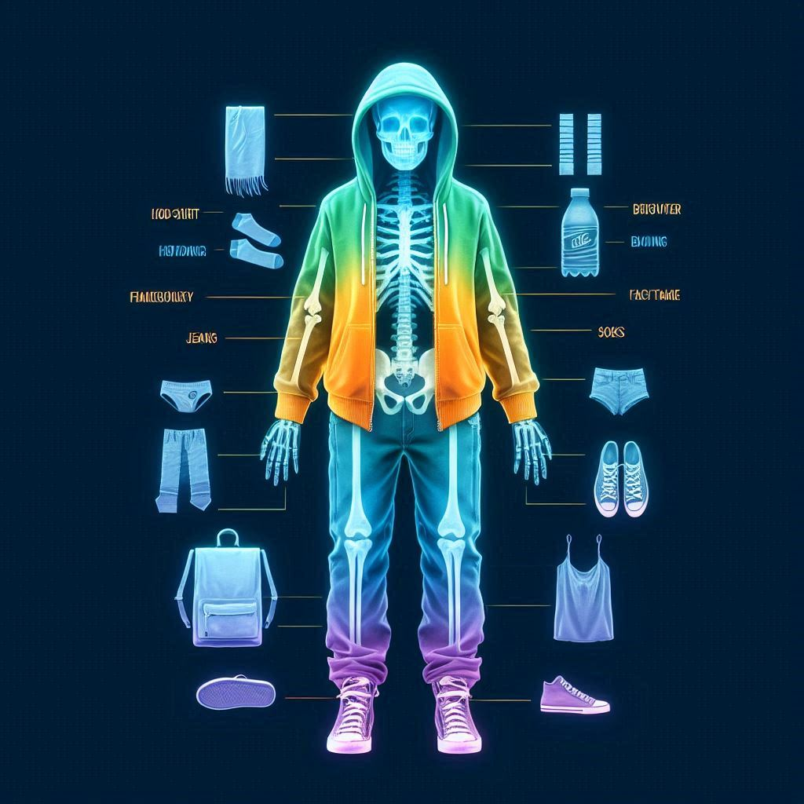
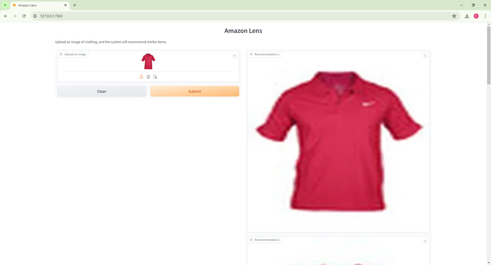
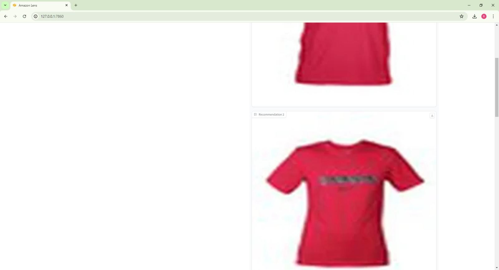
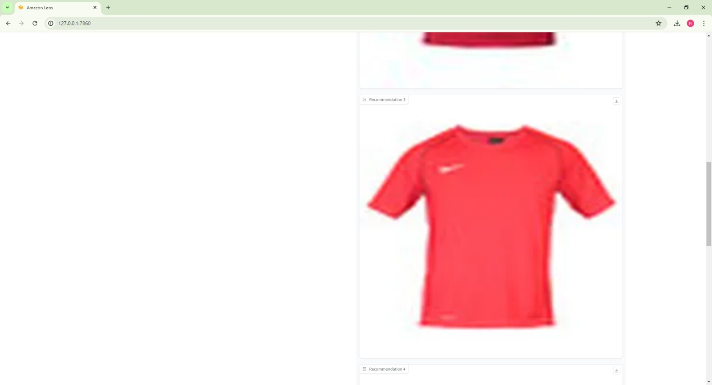

# Fashion X-ray

Fashion X-ray is a comprehensive solution designed to enhance your fashion experience through cutting-edge AI technologies. It comprises three main components:

Fashion Detector: Detects fashion objects in a video using the YOLOv8 model.

Style Recommender: Allows users to upload images of any clothing apparel and displays similar products using CNN and KNN models.

Virtual Try-On: Enables users to virtually try on clothes.

Fashion X-ray integrates advanced machine learning models to provide a seamless fashion experience. From detecting fashion items in videos to recommending similar products and allowing virtual try-ons, this project aims to revolutionize the way you interact with fashion.

### Features

#### Fashion Detector

The Fashion Detector utilizes the YOLOv8 model to identify fashion items in videos. This component can detect various clothing and accessories, making it a powerful tool for fashion analysis.

#### Style Recommender

The Style Recommender leverages Convolutional Neural Networks (CNN) and K-Nearest Neighbors (KNN) algorithms to recommend similar fashion products. Users can upload an image of any clothing item, and the system will display similar items available in the database.

#### Virtual Try-On

The Virtual Try-On feature allows users to virtually try on clothes. This component uses state-of-the-art computer vision techniques to overlay selected apparel onto the user's image, providing a realistic preview of how the clothes would look when worn.

## Presentation

For more details, you can check out the [Fashion X-ray Presentation](./images/Presentation.pdf).
